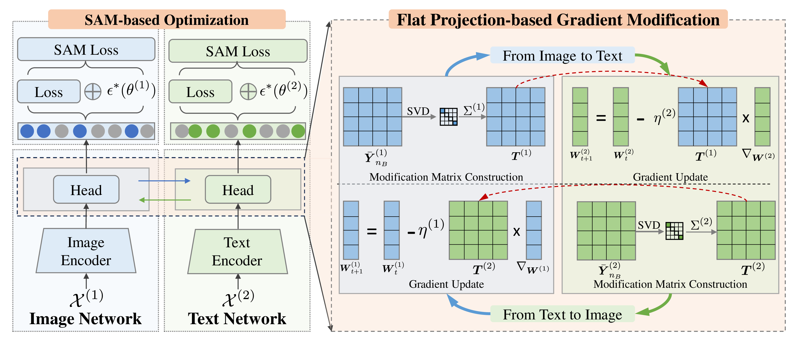

# Released Code for Paper"IGM: Interactive Multimodal Learning via Flat Gradient Modification"


<p align="center">

</p>
- Authors: Qing-Yuan Jiang, Zhouyang Chi, Yang Yang
- Contact: jiangqy@njust.edu.cn, 122106222804@njustedu.cn, yyang@njust.edu.cn

## 1.Introduction

Here is the official PyTorch implementation of IGM proposed in "Interactive Multimodal Learning via Flat Gradient Modification".

Our method consisting of two submodules:

1. Independ Interactive Flat Gradient Modification, which uses the SVD operation to obtain the knowledge and modifies the gradient during the backward phase.

2. SAM-based Optimization, which is designed to fully explore the flat-direction gradient modification design.

See our paper for a detailed description of IGM.

## 2.Usage

### 2.1Environment

* python 3.7
* pyTorch 1.12.1
* torchvision 0.13.1
* opencv 4.9.0
* numpy 1.21.6
* transformers 4.30.2

### 2.2 Pretrained model preparation

If you want to run the method on a text-image dataset such as Sarcasm. Please download the pretrained text and image encoder and place it to the corresponding path.

Text encoder : [bert-base-uncased]([google-bert/bert-base-uncased at main (huggingface.co)](https://huggingface.co/google-bert/bert-base-uncased/tree/main))

Image encoder : [Resnet50](https://download.pytorch.org/models/resnet50-0676ba61.pth) from torchvision

For NVGesture dataset, please down load the rgb_imagenet.pt and flow_imagenet.pt form this [link](https://github.com/piergiaj/pytorch-i3d/tree/master/models)

### 2.3 Data Preparation

You can download the corresponding raw data from the link below and prepare the data according the instructions of the cited paper. 

Original Dataset : [CREMA-D](https://github.com/CheyneyComputerScience/CREMA-D),[Kinetics-Sounds](https://github.com/cvdfoundation/kinetics-dataset),[Sarcasm](https://github.com/feiLinX/Multi-modal-Sarcasm-Detection),[Twitter15](https://github.com/jefferyYu/TomBERT),[NVGresutre](https://research.nvidia.com/publication/2016-06_online-detection-and-classification-dynamic-hand-gestures-recurrent-3d)

The directory organization of the final data file should be as follows.

```
data_root/
│
├── CREMAD/
│   ├── annotations/
│	│	├── train.csv
│	│	├── valid.csv
│   │	└── test.csv
│   ├── AudioWAV/
│  	│   ├── 1001_DFA_ANG_XX.wav
│  	│   ├── ...
│   │   └── 1091_WSI_SAD_XX.wav
│   └── Image-01-FPS/
│		├── 1001_DFA_ANG_XX/
│		│	└──xxxx,jpg
│		└── ...
│			
├── kinetics_sound/
│   ├── annotations/
│	│	├── train.csv
│	│	├── valid.csv
│   │	└── test.csv
│   ├── train_wav/
│  	│   ├── __Ezu3Z_N9U-000002——000012.wav
│  	│   └── ...
│   │    
│   ├── train_img/Image-01-FPS/
│	│	├── __Ezu3Z_N9U-000002——000012/
│	│	│	└──xxxx,jpg
│	│	└── ...
│	├── test_wav/	
│	│	└── ...
│  	└── test_img/
│		└── ...
│
├── NVGesture/
│	├── nvgesture_train_correct_v2.lst
│	├── nvgesture_valid_correct_v2.lst
│   ├── nvgesture_test_correct_v2.lst
│	└── Video_data/
│		├── class_01/
│		│	├── subject1_r0/
│		│	│	├── xxx.txt
│		│	│	└── xxx.avi
│		│	└── ...
│		└── ...
│
├── sarcasm/
│   ├── annotations/
│	│	├── train_data.csv
│	│	├── valid_data.csv
│   │	└── test_data.csv
│   └── images/
│  		├── xxxx.jpg
│  		└── ...
│       
└── Twitter15/
 	├── annotations/
	│	├── train_data.tsv
	│	├── valid_data.tsv
   	│	└── test_data.tsv
   	└── twitter2015_images/
  	    ├── xxxx.jpg
  	    └── ...

```


### 2.4 Training & Test

#### Kinetics-Sound

Specify the data path ("data_root") in configs/kinetics_sound.json. Then running the following commend:
```bash
$ python train_KS.py --config configs/kinetics_sound.json
```

#### CREMA-D

Specify the data path ("data_root") in configs/cream.json. Then running the following commend:
```bash
$ python train_CREMA.py --config configs/cream.json
```

#### Sarcasm

Specify the data path ("data_root") in configs/sarcasm.json. Then running the following commend:
```bash
$ python train_sarcasm.py --config configs/sarcasm.json
```

#### Twitter15

Specify the data path ("data_root") in configs/twitter.json. Then running the following commend:

```bash
$ python train_twitter.py --config configs/twitter.json
```

#### NVGesture

Specify the data path ("data_root") in configs/nvGesture.json. Then running the following commend:

```bash
$ python train_nvGesture.py --config configs/nvGesture.json
```

## 3.Citation

```
@article{DBLP:journals/corr/abs-2407-04587,
  author       = {Qing{-}Yuan Jiang and
                  Zhouyang Chi and
                  Yang Yang},
  title        = {Multimodal Classification via Modal-Aware Interactive Enhancement},
  journal      = {CoRR},
  volume       = {abs/2407.04587},
  year         = {2024}
}
```

